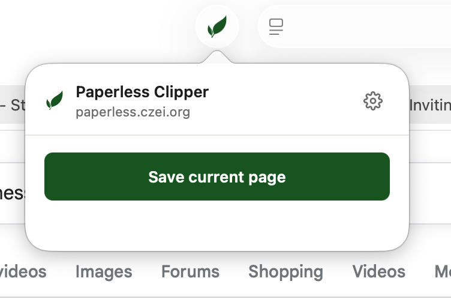
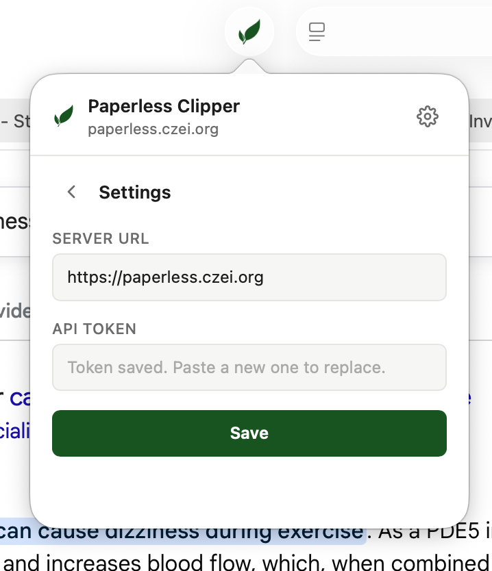

# Paperless Clipper

A Safari Web Extension for macOS and iOS/iPadOS that one-tap-saves the
active webpage to a self-hosted [Paperless-ngx](https://docs.paperless-ngx.com/)
server.

You share the page; classification (tags, correspondent, document
type, refined title) happens server-side via Paperless's existing
AI/classifier pipeline. There is no metadata UI on the save path.

- **Source code & releases**:
  [github.com/czei/paperless-safari-extension](https://github.com/czei/paperless-safari-extension)
- **Privacy policy**: [/privacy](./privacy)
- **Latest macOS download**:
  [Releases](https://github.com/czei/paperless-safari-extension/releases)

## Screenshots

